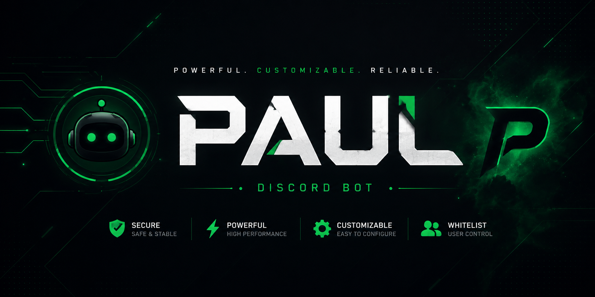

<p align="center">
  
</p>

<h1 align="center">Paul Discord Bot</h1>

<p align="center">
  My first Discord bot project built with Python.
</p>

---

## About

Paul is a customizable Discord bot built for learning Python and Discord bot development.

This project includes:

* Custom command prefix
* User whitelist system
* Automatic setup wizard
* Guild configuration
* Easy deployment with batch files

## Installation

### Clone the repository

```bash
git clone https://github.com/akatsukibottiktok-blip/Paul_Discord-Bot.git
cd Paul_Discord-Bot
```

### Install requirements

```bash
pip install -r requirements.txt
```

### Build the bot

```bash
build_bot.bat
```

Follow the setup wizard and enter:

* Bot Token
* Command Prefix
* Whitelisted User IDs
* Guild ID

### Start the bot

```bash
start_bot.bat
```

## Requirements

* Python 3.10+
* Discord Bot Token
* Internet Connection

## Configuration

Before running the bot:

1. Create a Discord Application.
2. Create a Bot.
3. Copy the Bot Token.
4. Enable the required Gateway Intents.
5. Invite the bot to your server.

## Repository Structure

```text
assets/          Images and banners
modules/         Bot modules
build.py         Setup wizard
build_bot.bat    Build script
start_bot.bat    Launch script
README.md        Documentation
```

## Disclaimer

This project was created for educational and learning purposes.

Use it only in servers that you own or have permission to manage. Always follow Discord's Terms of Service.

## License

MIT License
